# 🕊️ GHADS — Gaza Humanitarian Aid Distribution System

> A desktop application built to coordinate humanitarian aid distribution for displaced families in Gaza — ensuring fairness, transparency, and no family is left behind.

---

## 📌 System Name & Purpose

**GHADS (Gaza Humanitarian Aid Distribution System)** is a Java desktop application designed to help multiple humanitarian organizations coordinate aid distribution from one centralized platform.

The system provides two roles:
- **Admin** — manages the entire platform: organizations, users, families, and reports
- **Coordinator** — works within their organization: registers families and records aid distributions

---

## ❗ The Problem It Solves

When multiple humanitarian organizations operate independently, the same family may receive aid multiple times while another family receives nothing at all.

**GHADS solves this by:**
- Maintaining **one shared database** for all organizations
- Running an **automatic duplicate check** before saving any aid record
- If a family's vulnerability level is **MEDIUM or LOW** and they already received aid within the last **30 days** → the system **rejects** the distribution and shows a clear alert
- If a family's vulnerability level is **HIGH** → the system **always allows** the distribution regardless
- Making it easy to identify **families not yet served** so no household is forgotten

---

## 🛠️ Technologies Used

| Technology | Purpose |
|---|---|
| **Java** | Core programming language |
| **JavaFX** | Desktop UI framework |
| **Scene Builder** | Visual FXML design tool |
| **CSS** | UI styling and theming |
| **MySQL** | Relational database |
| **JPA (EclipseLink)** | Object-Relational Mapping (ORM) |
| **NetBeans IDE** | Development environment |

---

## 🏗️ Architecture Pattern

The system follows two main architectural patterns:

### 1. MVC — Model View Controller
Separates the application into three layers:

```
Model      → Java classes that represent database tables
           → Organization, User, Family, AidDistribution

View       → FXML files that define the UI screens
           → Login.fxml, AdminDashboard.fxml, CoordinatorDashboard.fxml

Controller → Java classes that handle user interactions and business logic
           → LoginController, AdminDashboardController, CoordinatorDashboardController
```

### 2. DAO — Data Access Object
All database operations are isolated in dedicated DAO classes:

```
OrganizationDAO   → CRUD operations for organizations
UserDAO           → CRUD operations + login + username/email validation
FamilyDAO         → CRUD operations + duplicate check + vulnerability filter
AidDistributionDAO → Add distributions + query by organization + last record lookup
```

### 3. Singleton — JPAUtil
The `EntityManagerFactory` is created only once and reused across the application:

```java
// One instance for the entire application lifecycle
private static EntityManagerFactory emf;

public static EntityManager getEntityManager() {
    return getEMF().createEntityManager();
}
```

---

## 🗄️ Database Schema

```
Organization ──< User
Organization ──< AidDistribution
Family       ──< AidDistribution
User         ──< AidDistribution
```

| Table | Key Fields |
|---|---|
| `Organization` | org_id, name, type, contact_info |
| `User` | user_id, username, password, full_name, email, role, org_id |
| `Family` | family_id, household_name, national_id, vulnerability_level, last_aid_date |
| `AidDistribution` | distribution_id, family_id, org_id, distributed_by, distribution_date |

---

## ✨ Key Features

- 🔐 **Role-based login** — Admin and Coordinator see different dashboards
- 📊 **Live statistics** — Total families, served, and not yet served
- 🔁 **Duplicate aid check** — Automatic 30-day check before saving any distribution
- 🔴 **Vulnerability-aware** — HIGH families always receive aid; MEDIUM/LOW are protected
- 🏢 **Organization management** — Full CRUD for all organizations
- 👥 **User management** — Admin creates and manages coordinator accounts
- 🏠 **Family registry** — Unique national ID prevents duplicate registrations
- 📋 **Aid records** — Full history with organization and date filters

---

## 📁 Project Structure

```
GHADS/
├── src/
│   ├── app/
│   │   └── Main.java
│   ├── confiq/
│   │   └── JPAUtil.java
│   ├── models/
│   │   ├── Organization.java
│   │   ├── User.java
│   │   ├── Family.java
│   │   └── AidDistribution.java
│   ├── dao/
│   │   ├── OrganizationDAO.java
│   │   ├── UserDAO.java
│   │   ├── FamilyDao.java
│   │   └── AidDistributionDAO.java
│   ├── controllers/
│   │   ├── LoginController.java
│   │   ├── MenuBarController.java
│   │   ├── AdminDashboardController.java
│   │   └── CoordinatorDashboardController.java
│   ├── views/
│   │   ├── Login.fxml
│   │   ├── MenuBar.fxml
│   │   ├── AdminDashboard.fxml
│   │   └── CoordinatorDashboard.fxml
│   ├── style/
│   │   └── style.css
│   └── META-INF/
│       └── persistence.xml
```

---

## 🚀 How to Run

1. Clone the repository
2. Open the project in **NetBeans**
3. Make sure **MySQL** is running and create the database:
```sql
CREATE DATABASE ghads_db;
```
4. Insert the admin account manually:
```sql
INSERT INTO user (username, password, full_name, email, role, org_id)
VALUES ('admin', 'admin123', 'System Admin', 'admin@ghads.com', 'ADMIN', NULL);
```
5. Run `Main.java`

---

## 📸 Screenshots

### Login Screen
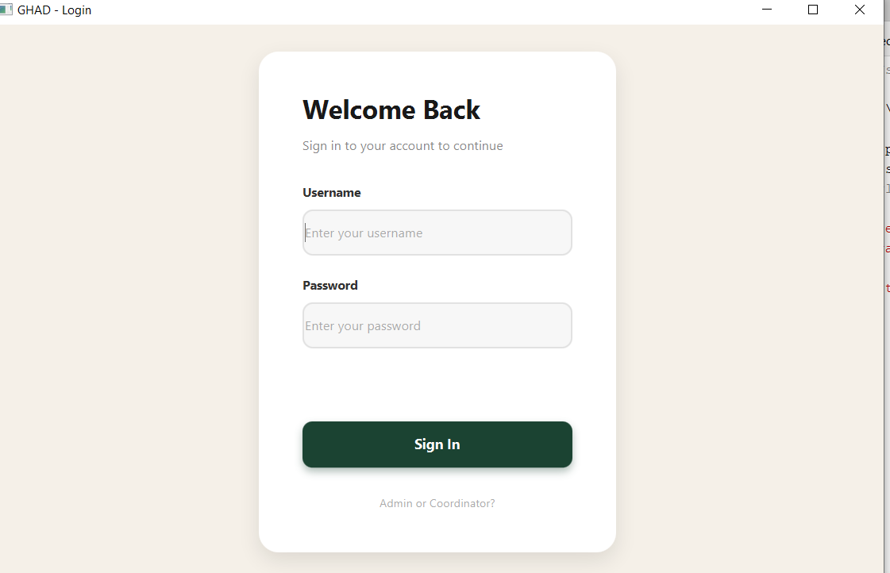

### Admin Dashboard
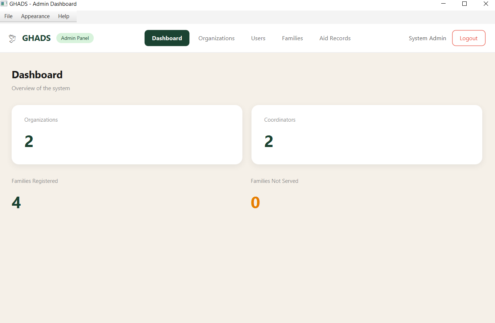

### Admin Users
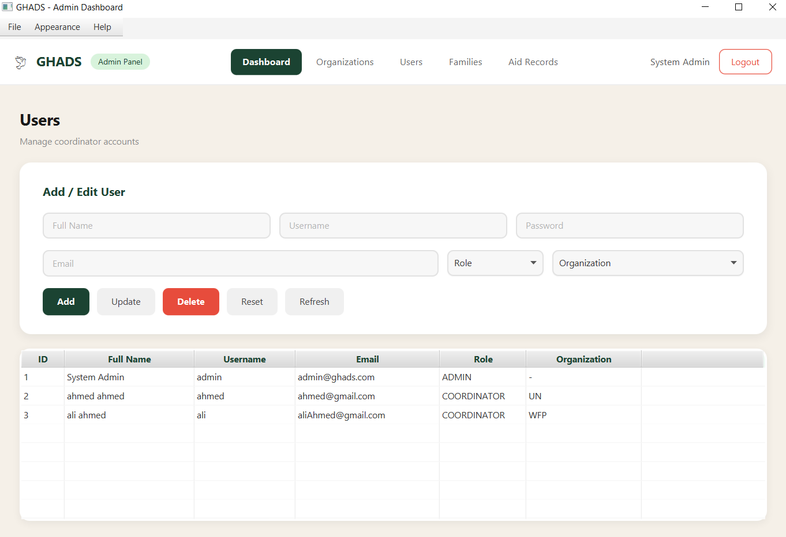

### Admin Family
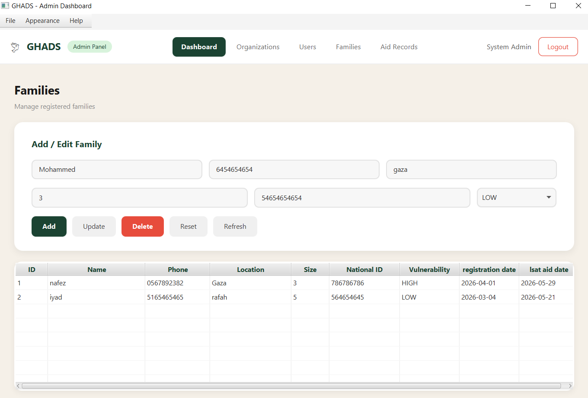

### Admin Organization
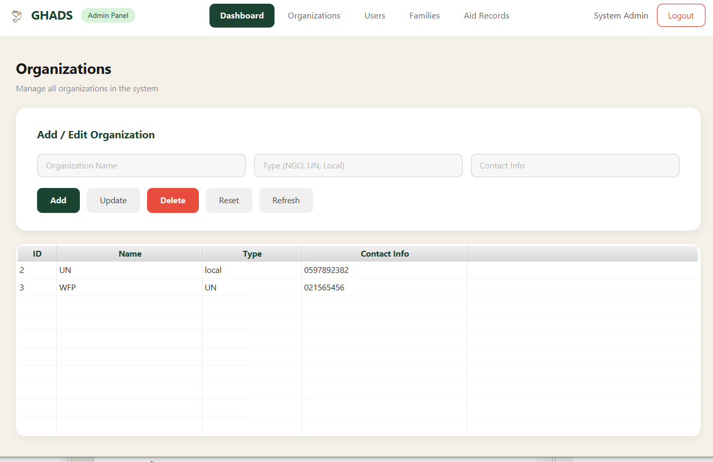

### Admin Aid
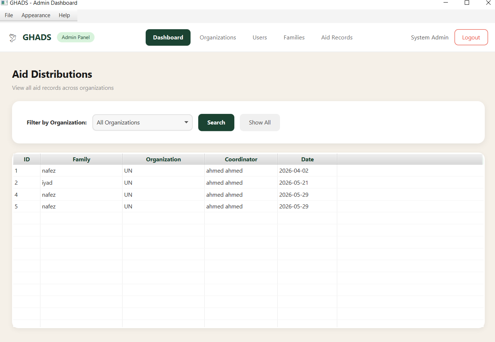


### Coordinator Dashboard
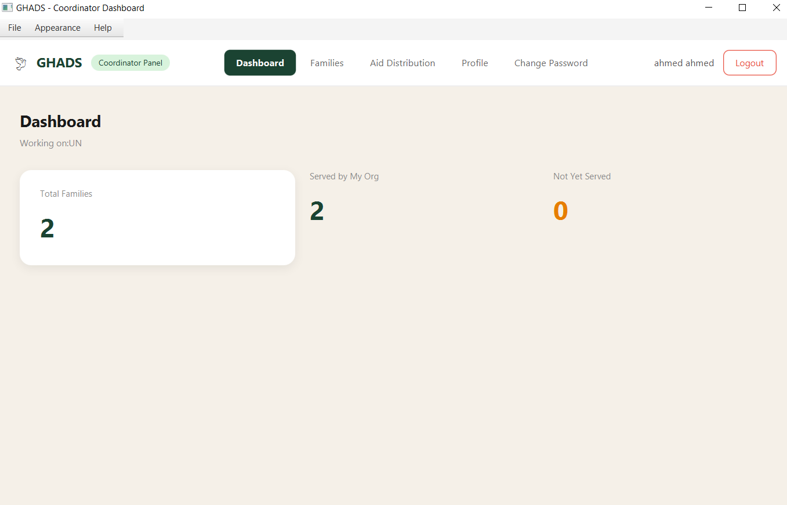

### Coordinator Family
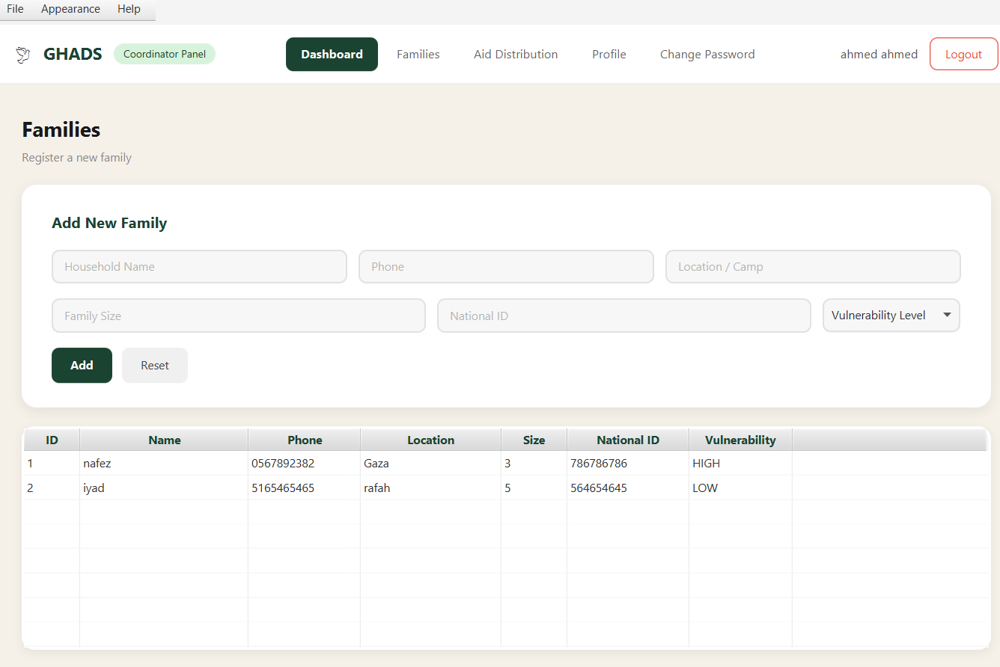

### Coordinator Aid
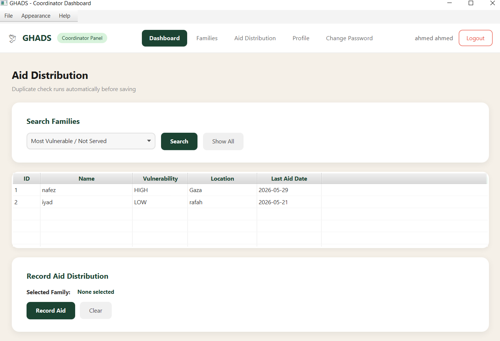

### Coordinator Profile
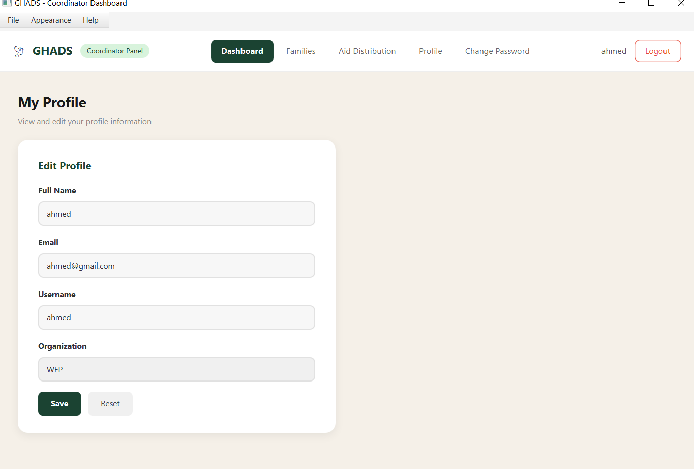

### Coordinator ChangePassword
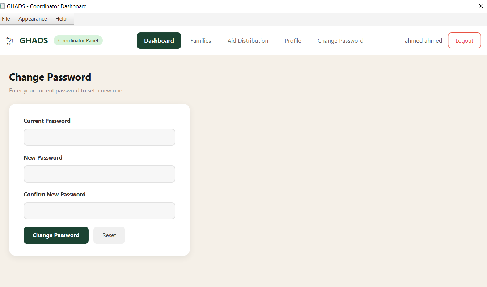


## 👩‍💻 Developer
Raghad Saqallah
Developed as a Final Project for **Programming III Lab -**  
The Islamic University of Gaza  
Instructor: **Aya N. Alharazin** — 2026
